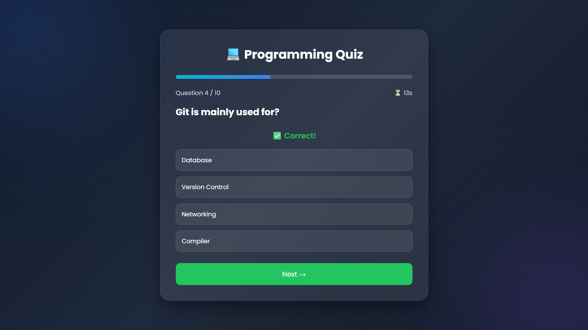

# 💻 Programming Quiz Application

## 📌 SkillCraft Technology - Web Development Internship

### Task 03: Interactive Quiz Application

This project is a modern and responsive **Programming Quiz Application** built using **HTML, CSS, and JavaScript**. It presents multiple-choice programming questions, provides instant feedback, tracks the user's score, and displays a detailed result screen upon completion.

---

## 🚀 Features

- 📝 Multiple Choice Questions
- 📊 Progress Bar
- ⏳ 20-Second Countdown Timer
- ✅ Instant Answer Feedback
- 🟢 Correct & 🔴 Incorrect Answer Highlighting
- 🎯 Automatic Score Calculation
- 🏆 Performance Rating
- 🔄 Play Again Option
- 📱 Fully Responsive Design
- 🎨 Modern Glassmorphism User Interface

---

## 🛠️ Technologies Used

- HTML5
- CSS3
- JavaScript (ES6)

---

## 📂 Project Structure

```
SCT_WD_3/
│
├── index.html
├── style.css
├── script.js
└── README.md
```

---

## 🌐 Live Demo

---

https://pv8925844-jpg.github.io/SCT_WD_3/

---

## 🌐 Repository Link

---

https://github.com/pv8925844-jpg/SCT_WD_3

---

## 📸 Preview

```md

```

---

## 📖 How to Run the Project

1. Download or clone the repository.
2. Open the project folder in **VS Code**.
3. Open `index.html` using **Live Server** or any modern web browser.
4. Start answering the quiz questions.

---

## 🎯 Learning Outcomes

Through this project, I learned:

- DOM Manipulation
- Event Handling
- Arrays & Objects in JavaScript
- Dynamic UI Rendering
- Timer using `setInterval()`
- Conditional Logic
- Responsive Web Design
- Interactive User Experience Design

---

## 👨‍💻 Author

**Piyush Verma**

B.Tech Software Engineering Student

---

## ⭐ Acknowledgement

This project was developed as part of the **SkillCraft Technology Web Development Internship** to strengthen front-end web development skills using HTML, CSS, and JavaScript.